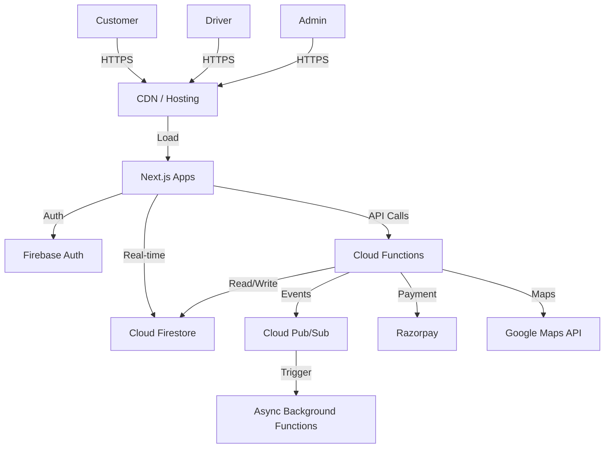
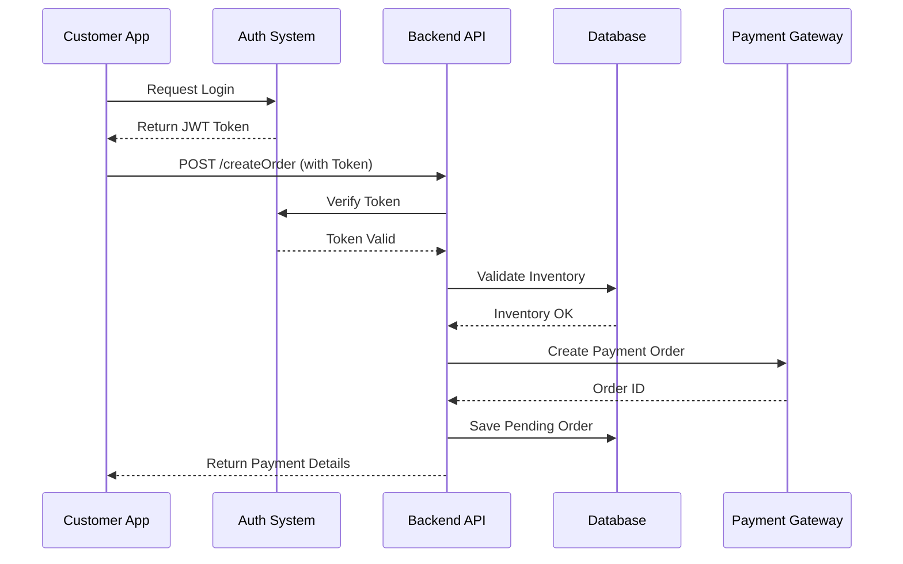

# High-Level System Architecture (HLD)

## Architecture Overview
FlashFit utilizes a **Serverless Event-Driven Architecture** primarily built on Google Cloud Platform (Firebase). This ensures automatic scaling, zero server maintenance, and pay-as-you-go cost efficiency.

### Microservices vs. Monolith
- **Decision:** **Serverless Microservices (FaaS)**.
- **Reasoning:**
    - **Scalability:** Each function scales independently (e.g., the "Order Processing" function can scale up during dinner time without affecting the "User Profile" function).
    - **Cost:** No idle server costs.
    - **Resilience:** Failure in one function does not crash the entire system.

## Core Components

### 1. Client Layer (Frontends)
- **Customer Web App:** Next.js (SSR/CSR) hosted on Vercel/Firebase Hosting.
- **Driver Web App:** Next.js PWA for mobile optimization.
- **Admin Dashboard:** React/Next.js SPA for internal management.

### 2. API Gateway / Entry Point
- **Firebase Cloud Functions:** Acts as the backend logic layer.
- **HTTPS Triggers:** RESTful endpoints for client interactions.
- **Background Triggers:** Firestore triggers (onCreate, onUpdate) for async processing.

### 3. Authentication & Security
- **Service:** Firebase Authentication.
- **Flow:**
    - Client logs in -> Firebase returns JWT (ID Token).
    - Client sends JWT in Header -> Backend verifies signature.
- **Methods:** Email/Password, Phone Auth (OTP), Social Login.

### 4. Database Layer
- **Primary DB:** Cloud Firestore (NoSQL).
    - **Why?** Real-time listeners, flexible schema, horizontal scaling.
- **Caching:** In-memory caching within function instances (limited) or dedicated Redis (optional for future high-load).

### 5. Queue & Async Processing
- **Event Bus:** Google Cloud Pub/Sub (integrated with Cloud Functions).
- **Use Cases:** Sending emails, processing analytics, dispatching driver notifications.

### 6. External Services
- **Payments:** Razorpay (Payment Gateway).
- **Maps:** Google Maps Platform / Leaflet (Routing, Geocoding).
- **Storage:** Cloud Storage for Firebase (Images, Documents).

### 7. Logging & Monitoring
- **Tools:** Google Cloud Logging, Firebase Performance Monitoring.

## Diagrams

### Architecture Diagram

### Data Flow Diagram (Order Creation)

