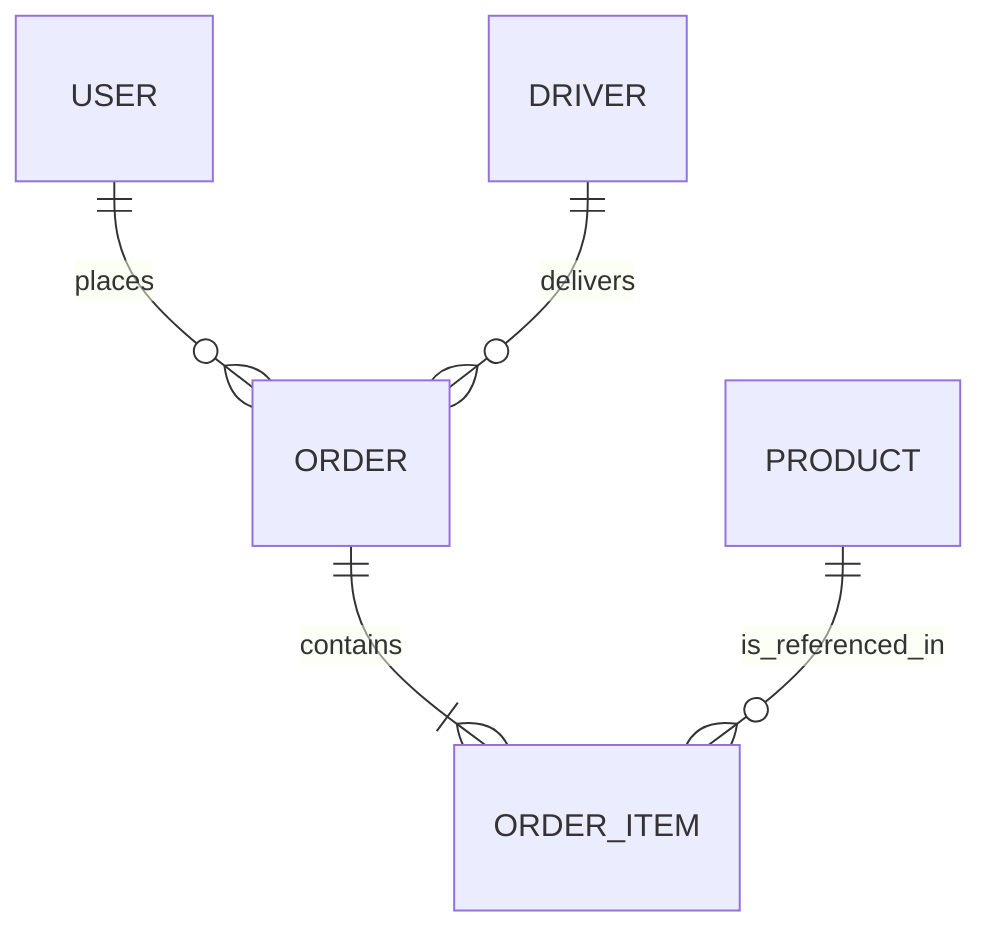

# Low-Level Design (LLD)

## Data Models & Entities

### 1. User (Customer)
- `uid` (string): Unique Identifier
- `email` (string): User email
- `displayName` (string): Full name
- `phoneNumber` (string): Contact number
- `addresses` (array): List of saved addresses
- `createdAt` (timestamp)

### 2. Driver
- `uid` (string): Unique Identifier
- `status` (enum): `offline`, `available`, `busy`
- `currentLocation` (GeoPoint): Lat/Lng
- `vehicleDetails` (object): Model, Plate Number
- `rating` (number): Average rating (1-5)

### 3. Product
- `id` (string): Product ID
- `name` (string): Product Name
- `price` (number): Unit price
- `category` (string): Category ID
- `stock` (number): Available quantity
- `images` (array): URLs

### 4. Order
- `id` (string): Order ID
- `customerId` (string): Reference to User
- `driverId` (string): Reference to Driver (nullable)
- `items` (array): List of product snapshots {id, name, price, qty}
- `totalAmount` (number): Final cost
- `status` (enum): `pending`, `confirmed`, `picked_up`, `delivered`, `cancelled`
- `paymentStatus` (enum): `pending`, `paid`, `failed`
- `createdAt` (timestamp)

## Database ERD (Conceptual)
Since we use Firestore (NoSQL), relationships are often denormalized, but logically:



## API Endpoints Specification

### Authentication
- `POST /auth/signup`: Create new user
- `POST /auth/login`: Exchange credentials for token (handled by Firebase SDK mostly)

### Orders
- `POST /orders`: Create a new order
    - **Request:** `{ items: [{productId, qty}], addressId }`
    - **Response:** `{ orderId, paymentLink, status }`
- `GET /orders/:id`: Get order details
- `PATCH /orders/:id/status`: Update status (Admin/Driver only)

### Inventory
- `GET /products`: List products with pagination
- `GET /products/:id`: Get single product details

## Folder Structure

### Backend (Functions)
```
/functions
  /src
    /controllers    # Request handlers
    /services       # Business logic
    /repositories   # Database access
    /models         # TypeScript interfaces
    /utils          # Helpers (validation, formatting)
    index.ts        # Entry point
```

### Frontend (Next.js)
```
/app
  /layout.tsx       # Root layout
  /page.tsx         # Home page
  /components       # Reusable UI components
    /ui             # Shadcn/Base components
    /features       # Feature-specific components
  /lib              # Utilities, API clients
  /store            # Zustand stores
  /hooks            # Custom React hooks
```

## Error Handling Architecture
- **Global Error Handler:** Middleware in backend to catch exceptions.
- **Standardized Error Response:**
  ```json
  {
    "success": false,
    "error": {
      "code": "INSUFFICIENT_STOCK",
      "message": "Product X is out of stock",
      "details": { ... }
    }
  }
  ```
