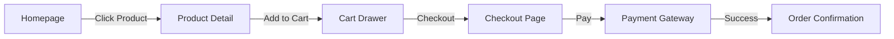

# Frontend Explanation

## Technology Stack
- **Framework:** Next.js 14 (App Router)
- **Language:** TypeScript
- **Styling:** Tailwind CSS + Shadcn UI (for accessible components)
- **State Management:** Zustand (lightweight, global state)
- **Maps:** React Leaflet / Google Maps API
- **Animations:** Framer Motion

## Component-Based Architecture
We follow the **Atomic Design** principles loosely:
- **Atoms:** Buttons, Inputs, Labels (Base UI components).
- **Molecules:** SearchBar (Input + Button), ProductCard (Image + Title + Price).
- **Organisms:** Navbar, Footer, ProductGrid.
- **Templates:** Page layouts (SidebarLayout, AuthLayout).

## State Management Strategy
- **Server State:** Handled by React Query (or direct fetch in Server Components) for caching and synchronization.
- **Client State:** Zustand for UI state (e.g., IsSidebarOpen, CartItems).
- **Form State:** React Hook Form for validation and handling inputs.

## API Consumption
- **Server Components:** Fetch data directly from Firestore/API for SEO and performance.
- **Client Components:** Use custom hooks (e.g., `useOrders`) wrapping `fetch` or Firebase listeners for real-time updates.

## Responsive Design Principles
- **Mobile-First:** Styles are written for mobile first, then overridden for larger screens (`md:`, `lg:`).
- **Fluid Typography:** Text scales with viewport width.
- **Touch Targets:** Buttons and inputs are at least 44px height for mobile usability.

## User Flow Diagram (Shopping)

