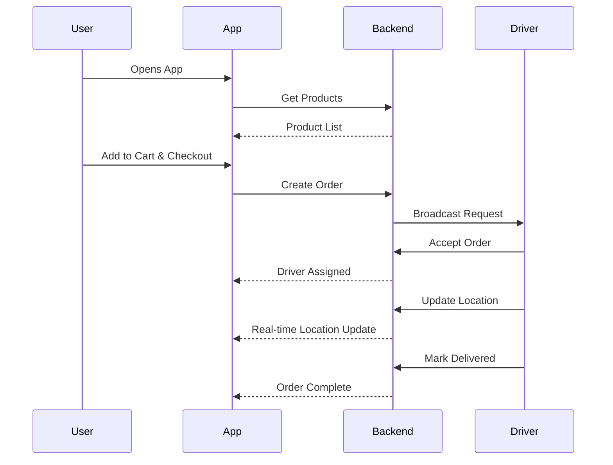

# Customer Journey & User Flow

## Narrative: The "FlashFit" Experience

### 1. Discovery & Signup
**Alice** sees an ad for FlashFit. She downloads the app or visits the site.
- **Action:** Enters phone number.
- **System:** Sends OTP.
- **Alice:** Verifies OTP.
- **Result:** Account created, logged in.

### 2. Browsing & Selection
Alice wants protein powder and a yoga mat.
- **Action:** Searches "Whey Protein".
- **System:** Shows results sorted by relevance and delivery speed.
- **Action:** Adds to cart.

### 3. Checkout & Payment
- **Action:** Proceeds to checkout. Confirms address.
- **System:** Calculates delivery fee and total.
- **Action:** Pays via UPI/Card (Razorpay).
- **System:** Verifies payment, creates order, notifies store/driver.

### 4. Order Fulfillment
- **Store:** Accepts order, packs items.
- **Driver (Bob):** Receives notification "New Order nearby". Accepts.
- **System:** Assigns Bob to Alice's order.

### 5. Delivery & Tracking
- **Alice:** Sees Bob's location moving in real-time on the map.
- **Bob:** Navigates to store, picks up, navigates to Alice.
- **Action:** Bob arrives, hands over package.
- **System:** Bob marks "Delivered".

### 6. Post-Purchase
- **Alice:** Receives "Delivered" notification. Prompts to rate Bob.
- **Action:** Alice rates 5 stars.

## User Flow Diagram

